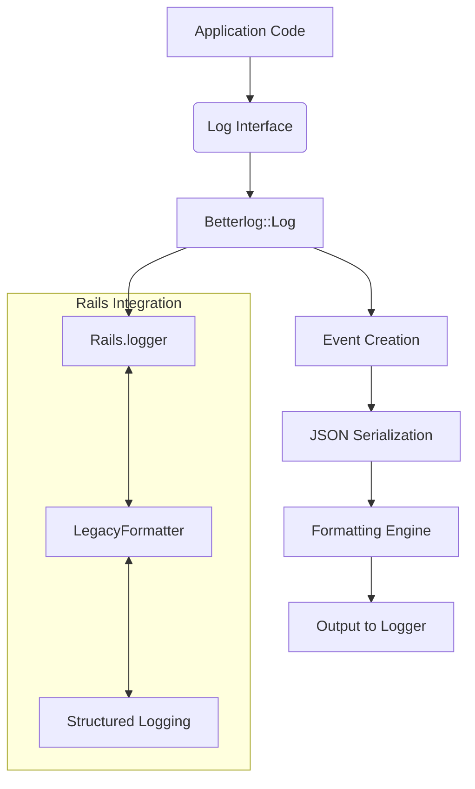
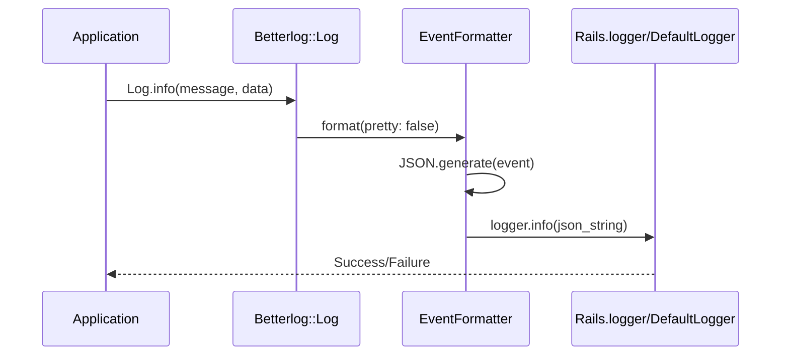
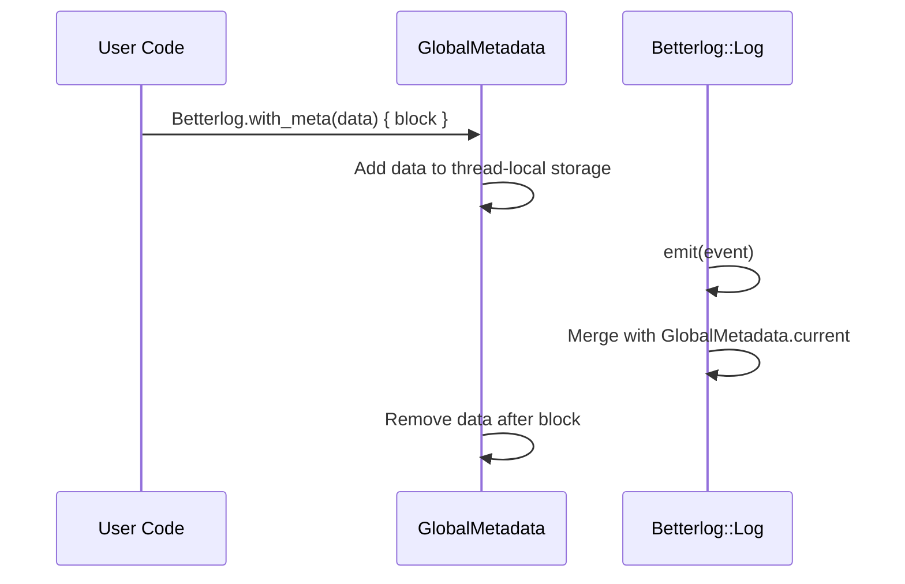

# betterlog

## Description

Structured logging support for Rails applications with flexible formatting and
filtering capabilities.

## Installation

You can use rubygems to fetch the gem and install it for you:

    # gem install betterlog

You can also put this line into your Gemfile:

    gem 'betterlog'

and bundle. This will make the `Betterlog` module and its logging facilities
available.

## Usage

### Basic Logging

The main logging interface provides structured JSON logging with automatic
Rails integration:

```ruby
# Log simple messages
Log.info("User logged in", meta: { module: 'session', user_id: 123 })
Log.error("Database connection failed", meta: { module: 'database', error: "Connection timeout" })

# Log exceptions with full backtrace information
begin
  # some code that might fail
rescue => e
  Log.error(e, meta: { module: 'api_v4', context: "API request processing" })
end
```

### Command-Line Interface

The `betterlog` CLI tool provides powerful log file processing and filtering
capabilities:

#### Basic Usage

Tail local logfiles:
```bash
$ betterlog -f
```

Filter from stdin:
```bash
$ cat log/development.log | betterlog
```

Search for GET in the last 1000 rails log lines:
```bash
$ betterlog -F rails -n 1000 -s GET
```

Display help for all options:
```bash
$ betterlog -h
```

#### Command-Line Options

- `-c` Enable colors during pretty printing
- `-f` Follow the log files in real-time
- `-h` Display help information
- `-p FORMAT` Pretty print log files (e.g., `long`, `short`)
- `-e EMITTER` Only output events from specific emitters
- `-s MATCH` Only display events matching search string
- `-S SEVERITY` Only output events with specified severity level
- `-n NUMBER` Rewind this many lines backwards before tailing
- `-F SHORTCUT` Use configuration file shortcuts

#### Examples

Follow Rails logs with colorized output for errors or greater:
```bash
$ betterlog -f -F rails -p long -c -S ">=error"
```

Search for specific terms in log files:
```bash
$ betterlog -f -s SELECT
```

This filters out all logging messages where `meta: { module: 'api_v4' }` was
given:

```
$ betterlog -f -s meta:module=api_v4
```

Follow multiple log files with default format in colors including the last 10
lines:
```bash
$ betterlog -f -F rails -F redis -pd -c -n 10
```

Filter stdin from file with default format in color:
```bash
$ betterlog -pd -c < unicorn.log
```

Filter last 10 lines of a file with default format in color:
```bash
$ betterlog -c -pd -n 10 unicorn.log
```

### Architecture Overview

Betterlog follows a modular architecture where different components work
together to provide structured logging:



**Diagram Explanation**: This shows how the system is structured. Application
code calls the logging interface (`Log.info`), which creates structured events
and processes them through JSON serialization and formatting before outputting
to either Rails' logger or a default logger. The Rails integration section
shows how it seamlessly connects with Rails' existing logging infrastructure.

### Logging Flow

When you call a logging method, the following process occurs:



**Diagram Explanation**: This illustrates the complete logging workflow. When
you call `Log.info()`, it goes through the Betterlog::Log (or Log) class, gets
formatted into a structured event with JSON serialization, and finally outputs
to either Rails' logger or the default logger. The process is designed to
maintain structured logging while being compatible with existing Rails logging
systems.

### Thread-Local Metadata

Betterlog supports thread-local metadata that gets automatically included with
all log events:



**Diagram Explanation**: This shows how thread-local metadata works. When you
use `Betterlog.with_meta()`, it temporarily adds metadata to a thread-local
store, which gets merged with your log events during processing. The metadata
is automatically cleaned up after the block executes, ensuring thread safety
and preventing memory leaks.

**Practical Usage Examples**:

**In Rails Controllers** (from `application_controller.rb`):
```ruby
class ApplicationController < ActionController::Base
  # …
  around_action :set_global_metadata


  def set_global_metadata(&block)
    Betterlog.with_meta(
      request_id: request.request_id,
      user_id:    current_user&.id,
      &block
    )
  end
end
```
This ensures all logs within a request include user and request context
automatically.


**In Background Jobs** (from `booking_mandate/job.rb`):

```ruby
Betterlog.with_meta(
  module: 'booking',
  booking_mandate_id: id,
) do
  # All logs in this block automatically include:
  # - module: 'booking'
  # - booking_mandate_id: id
  Log.info("Successfully booked booking mandate #{id}")
end
```

This pattern provides consistent contextual information across all log entries
for a given request or job execution while maintaining thread safety.

These examples show how global metadata is actually used in production code:
1. **Controller level**: Automatically includes request and user context for
   all logs during a web request
2. **Job level**: Automatically includes job-specific context (like booking
   mandate ID) for all logs within that job execution

This makes debugging much easier since you can always trace logs back to their
specific context without having to manually pass around context information.

### Configuration

Configuration is handled through the `config/log.yml` file. The configuration
supports:

- Log formats and styling definitions
- Severity filtering rules
- Configuration shortcuts for different environments
- Color schemes for terminal output

Example configuration structure:
```yaml
development: &development
  level: <%= ENV.fetch('LOG_LEVEL', :debug).to_sym %>
  styles:
    'timestamp': [ yellow, bold ]
    'file': [ blue, bold ]
    severity:
      debug: green
      info: green
      warn:  yellow
      error: red
      fatal: [ red, blink ]
      unknown: red
  formats:
    default: &default_format >
      {%lt%timestamp} {%5s%severity}
      "{%0.<%= ENV.fetch('COLUMNS', 80).to_i / 2 %>%message}"
      {host}
      {location}
      {file}{-%O%backtrace}{-%O%meta}
    d: *default_format
    long: &long_format |
      type: {type}
      timestamp: {%lt%timestamp}
      severity: {severity}
      message: "{message}"
      error_class: {error_class}
      backtrace: {%O%backtrace}
      host: {host}
      location: {location}
      file: {file}
      meta: {%O%meta}\n
    l: *long_format
    legacy: >
      {%0.1s%severity} [{%lt%timestamp} #{%d%pid}] {%5s%severity} --
      {program}: {message}
  config_files:
    rails:
      - log/development.log
    test:
      - log/test.log
    mysql:
      - log/mysql/mysqld.log
      - log/mysql/mysql-slow.log
  legacy_supported: yes
test:
  <<: *development
  level: <%= ENV.fetch('LOG_LEVEL', :debug).to_sym %>
staging: *development
production:
  <<: *development
  level: <%= ENV.fetch('LOG_LEVEL', :info).to_sym %>
```

### Rails Integration

When used in a Rails application, betterlog automatically integrates with
Rails' logging system by detecting Rails presence and using `Rails.logger`
instead of its default logger. The system also includes a
`Betterlog::Log::LegacyEventFormatter` that ensures compatibility with existing
Rails logging formats.

## Download

The homepage of this library is located at

* https://github.com/betterplace/betterlog

## Author

The [betterplace Developers](mailto:developers@betterplace.org)

## License

This software is licensed under the [Apache 2.0 license](LICENSE)
